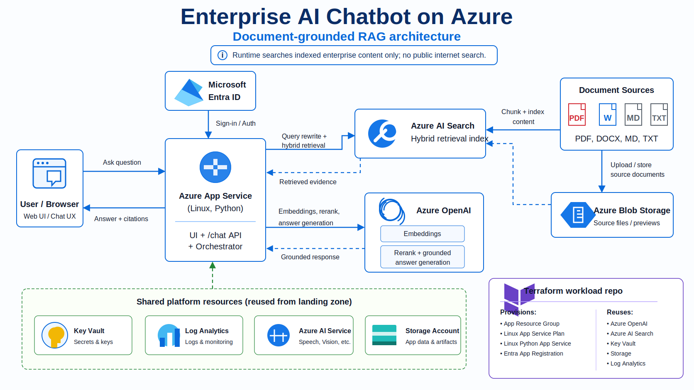

# Enterprise AI Chatbot on Azure — Architecture

## 1. Purpose

This document describes the architecture for the `enterprise-ai-chatbot` workload. The solution is a document-grounded Retrieval-Augmented Generation (RAG) chatbot deployed on Azure. The chatbot accepts user questions through a web chat interface, retrieves relevant evidence from enterprise-controlled content indexed in Azure AI Search, uses Azure OpenAI to generate a grounded answer, and returns the answer with citations.

The runtime design is intentionally restricted: it does not search the public internet during answer generation. It only searches enterprise content that has already been ingested, chunked, embedded, and indexed into Azure AI Search.



## 2. Architecture Summary

At a high level, the architecture contains four functional layers:

| Layer | Responsibility |
|---|---|
| User interaction layer | Browser-based chat experience where users ask questions and receive cited answers. |
| Application orchestration layer | Azure App Service hosts the Python application, chat API, authentication integration, query orchestration, retrieval workflow, reranking workflow, and response formatting. |
| Retrieval and generation layer | Azure AI Search performs hybrid retrieval. Azure OpenAI generates embeddings, optionally reranks candidate chunks, and produces grounded responses. |
| Platform and governance layer | Shared landing-zone resources provide Key Vault, Log Analytics, Storage Account, Azure OpenAI, Azure AI Service, and Azure AI Search. Terraform provisions only workload-specific resources and looks up shared resources with data sources. |

The architecture follows a workload-reuse model. The chatbot repository is not a full landing zone. It provisions the application-specific resources and reuses platform resources from an existing landing-zone deployment.

## 3. Repository Role

The `enterprise-ai-chatbot` repository is a Terraform workload repository. Its role is to deploy the app-specific infrastructure and configure the application to connect to shared platform services.

The repository provisions:

| Provisioned by this workload repo | Purpose |
|---|---|
| Application resource group | Logical container for the chatbot workload resources. |
| Linux App Service Plan | Compute plan for the Linux Python App Service. |
| Linux Python App Service | Hosts the chatbot web UI and `/chat` API. |
| Microsoft Entra app registration | Supports App Service authentication and identity integration. |

The repository reuses shared platform resources from the landing zone:

| Reused shared resource | Purpose |
|---|---|
| Shared resource group | Existing resource group where shared AI and platform services are deployed. |
| Storage account | Stores source documents, previews, app artifacts, or supporting files. |
| Key Vault | Stores secrets, keys, and sensitive configuration values. |
| Log Analytics workspace | Centralized logging and monitoring. |
| Azure OpenAI account | Provides chat and embedding model deployments. |
| Azure AI Service account | Supports broader Azure AI capabilities where needed. |
| Azure AI Search service | Stores searchable document chunks and vectors. |

This separation is correct for enterprise environments because the workload team can deploy and iterate the chatbot without duplicating shared AI, security, monitoring, and storage services.

## 4. Logical Components

### 4.1 User / Browser

The user interacts with the chatbot through a browser-based chat interface. The browser sends user questions to the backend application and receives answers with citations.

Primary responsibilities:

- Render the chat interface.
- Send the user question and optional chat history to the backend `/chat` endpoint.
- Display the generated answer.
- Render clickable source previews, metadata, and highlighted matching terms when available.
- Preserve enough conversation context for follow-up question rewriting.

The browser should not call Azure AI Search or Azure OpenAI directly. All calls must go through the backend orchestrator. Direct browser-to-AI-service calls would expose service endpoints, increase attack surface, and complicate access control.

### 4.2 Azure App Service

Azure App Service is the runtime host for the Python application. It is the central orchestrator of the solution.

Primary responsibilities:

- Host the web UI.
- Expose the `/chat` API.
- Integrate with Microsoft Entra ID for authentication when enabled.
- Rewrite vague or follow-up questions into standalone retrieval questions.
- Generate expanded retrieval queries.
- Request embeddings from Azure OpenAI.
- Query Azure AI Search using hybrid retrieval.
- Apply access filters and optional metadata filters.
- Deduplicate retrieved candidates.
- Optionally rerank candidate chunks using Azure OpenAI.
- Build the grounded answer-generation prompt.
- Validate citation integrity before returning the final answer.
- Return conservative refusals when evidence is weak or citations are invalid.

The App Service is the correct control point because it owns orchestration, policy enforcement, request shaping, retry logic, prompt assembly, citation validation, and response formatting.

### 4.3 Microsoft Entra ID

Microsoft Entra ID provides authentication and identity integration for the web application.

Primary responsibilities:

- Authenticate users before they access the chatbot.
- Provide identity context to the App Service.
- Support application assignment and enterprise access governance.
- Enable future authorization extensions based on user groups, roles, or claims.

The current architecture includes an Entra app registration for the App Service. This should be treated as an identity boundary. Authentication proves who the user is; authorization still needs explicit enforcement in the application or through App Service authentication configuration.

### 4.4 Azure AI Search

Azure AI Search is the retrieval engine. It stores indexed enterprise content as searchable records and supports hybrid retrieval.

Primary responsibilities:

- Store document chunks.
- Store vector embeddings for semantic similarity search.
- Support keyword or full-text search through `search_text`.
- Support vector retrieval through `VectorizedQuery`.
- Merge keyword and vector result sets through reciprocal rank fusion.
- Support metadata filters such as source path, document title, service area, document version, and access group.
- Return candidate evidence chunks to the App Service.

Azure AI Search is not responsible for generating answers. Its job is to retrieve evidence. Answer generation remains in Azure OpenAI, with the App Service enforcing grounding and citations.

### 4.5 Azure OpenAI

Azure OpenAI is used for embedding generation, optional reranking, and final answer generation.

Primary responsibilities:

- Generate embeddings for retrieval queries.
- Support query expansion and standalone question rewriting through a chat model.
- Rerank a broader set of retrieved candidates when reranking is enabled.
- Generate the final grounded answer using retrieved evidence.
- Return a structured JSON response containing answer text, citations, grounded status, and refusal reason.

The design should use separate deployments for chat and embeddings. This allows independent scaling, model selection, and cost control.

### 4.6 Azure Blob Storage / Storage Account

Blob Storage stores source documents and source previews.

Primary responsibilities:

- Store uploaded or ingested enterprise documents.
- Preserve source files for traceability.
- Support source preview rendering in the UI.
- Provide durable document storage separate from the search index.

The search index should not be treated as the system of record. The source files must remain in Storage Account because indexes can be rebuilt, migrated, or cleared.

### 4.7 Key Vault

Key Vault stores sensitive configuration values.

Primary responsibilities:

- Store secrets such as API keys where key-based authentication is still required.
- Store connection secrets or application configuration that should not be embedded in code.
- Support future managed-identity-based access patterns.

Hard-coding keys in repository files, pipeline variables, or application code is not acceptable for a production-grade architecture.

### 4.8 Log Analytics

Log Analytics provides centralized operational telemetry.

Primary responsibilities:

- Capture App Service logs.
- Support monitoring and troubleshooting.
- Store diagnostic data from Azure resources where diagnostic settings are configured.
- Enable KQL-based operational analysis.
- Support alerting for failures, latency, high error rates, and ingestion problems.

For production, the architecture should explicitly define log categories, retention, alerting rules, and dashboard ownership.

### 4.9 Azure AI Service

The architecture includes Azure AI Service as a shared landing-zone resource. The current chatbot runtime primarily depends on Azure OpenAI and Azure AI Search. Azure AI Service is available for extension scenarios such as document extraction, vision, speech, or other cognitive capabilities.

Do not imply that Azure AI Service is mandatory for the current RAG path unless the implementation actually uses it. Its correct role here is a reusable shared AI platform service for future capabilities.

## 5. Runtime Request Flow

The runtime flow is the critical path executed when a user asks a question.

### Step 1 — User submits a question

The user enters a question in the browser. The browser sends the question to the backend `/chat` endpoint. The request may include chat history, user groups, and optional metadata filters.

Example request shape:

```json
{
  "question": "How do I configure vector search?",
  "user_groups": ["default"],
  "chat_history": [
    {
      "role": "user",
      "content": "Tell me about Azure AI Search."
    },
    {
      "role": "assistant",
      "content": "Azure AI Search supports keyword, vector, hybrid, and semantic search."
    }
  ],
  "filters": {
    "source_path": "retrieval-augmented-generation-overview.md",
    "document_title": "Retrieval augmented generation",
    "section_heading": "Indexing strategy",
    "product_service": "search",
    "document_date": "2025-09-01",
    "document_version": "2025-09-01",
    "url": "https://learn.microsoft.com/...",
    "access_group": "default"
  }
}
```

### Step 2 — Authentication and access context are established

If App Service authentication is enabled, the user must authenticate through Microsoft Entra ID. The application can then use the authenticated identity and request-provided group context to apply retrieval filters.

This distinction matters:

- Authentication confirms the user identity.
- Authorization determines which documents or chunks the user is allowed to retrieve.
- Grounding determines whether the answer is supported by retrieved evidence.

These are separate controls and should not be collapsed into one vague “security” statement.

### Step 3 — Query rewrite and expansion

The application rewrites vague or follow-up questions into standalone retrieval questions. This is required because follow-up questions such as “How do I configure that?” are ambiguous without chat history.

The application may also generate expanded retrieval queries. Query expansion improves recall by searching for semantically related formulations of the same intent.

Controlled by:

| Setting | Default | Purpose |
|---|---:|---|
| `QUERY_REWRITE_ENABLED` | `true` | Enables standalone question rewriting and multi-query expansion. |
| `QUERY_EXPANSION_COUNT` | `3` | Maximum number of alternate retrieval queries generated before search. |
| `QUERY_REWRITE_HISTORY_MESSAGES` | `6` | Number of recent chat messages used to rewrite follow-up questions. |

### Step 4 — Embedding generation

The App Service sends each retrieval query to the configured Azure OpenAI embedding deployment. The embedding vector represents the semantic meaning of the query and is used for vector search.

Controlled by:

| Setting | Purpose |
|---|---|
| `AZURE_OPENAI_ENDPOINT` | Azure OpenAI account endpoint. |
| `AZURE_OPENAI_EMBED_DEPLOYMENT` | Embedding model deployment name. |

### Step 5 — Hybrid retrieval in Azure AI Search

The App Service queries Azure AI Search using hybrid retrieval:

- Keyword/full-text search using `search_text`.
- Vector search using `VectorizedQuery`.

Azure AI Search merges these result sets through reciprocal rank fusion. Hybrid retrieval is usually stronger than keyword-only search because it can match both exact terminology and semantic similarity.

Controlled by:

| Setting | Default | Purpose |
|---|---:|---|
| `HYBRID_SEARCH_TOP` | `5` | Number of hybrid results used when reranking is disabled, and fallback count if reranking fails. |
| `HYBRID_VECTOR_K` | `8` | Number of vector neighbors requested before Azure AI Search fuses results. |
| `AZURE_SEARCH_SEMANTIC_CONFIGURATION` | empty | Optional semantic configuration name. |
| `AZURE_SEARCH_ENDPOINT` | n/a | Azure AI Search service endpoint. |
| `AZURE_SEARCH_INDEX` | n/a | Azure AI Search index name. |

### Step 6 — Filters are applied

The application applies access filters and optional metadata filters. This is required to prevent retrieval leakage across document groups, business units, or security boundaries.

Common metadata fields include:

| Field | Source |
|---|---|
| `source_path` | Relative file path under `DOCS_PATH`. |
| `document_title` | Title metadata, first H1, or file name. |
| `section_heading` | Nearest heading inside the chunk. |
| `product_service` | `INGEST_PRODUCT_SERVICE`, `ms.service`, `service`, or folder name. |
| `document_date` | `ms.date` or `date` metadata. |
| `document_version` | `ms.version` or `version` metadata. |
| `url` | `url`, `canonical_url`, `ms.authoring-url`, or `DOCS_BASE_URL` plus path. |
| `access_group` | `INGEST_ACCESS_GROUP`, default `default`. |

### Step 7 — Candidate deduplication

Because query expansion can produce overlapping results, the application deduplicates candidates returned by expanded queries. Without deduplication, the same chunk can dominate the final evidence set and reduce answer quality.

### Step 8 — Optional reranking

If reranking is enabled, the application sends a broader candidate set to the Azure OpenAI chat deployment and asks it to rerank the retrieved evidence. Reranking improves precision, but it adds one extra chat completion call per user question.

Controlled by:

| Setting | Default | Purpose |
|---|---:|---|
| `RERANK_ENABLED` | `true` | Enables second-stage LLM reranking. |
| `RERANK_CANDIDATE_TOP` | `12` | Number of hybrid candidates retrieved before reranking. |
| `RERANK_TOP` | `5` | Number of reranked chunks sent to answer generation. |
| `RERANK_CONTENT_CHARS` | `1200` | Maximum characters per candidate sent to the reranker. |

For demos or cost-sensitive environments, `RERANK_ENABLED=false` can reduce latency and cost at the expense of precision.

### Step 9 — Grounded answer generation

The App Service sends the selected evidence chunks to Azure OpenAI with a grounded-answer instruction. The answer generation contract is structured JSON.

Expected output fields:

| Field | Meaning |
|---|---|
| `answer` | Final answer text. |
| `citations` | Evidence IDs used to support the answer. |
| `grounded` | Whether the model claims the answer is grounded in the provided evidence. |
| `refusal_reason` | Reason for refusal when the answer is not sufficiently supported. |

The model must not invent unsupported content. If evidence is insufficient, the correct behavior is a conservative refusal.

### Step 10 — Citation validation

The App Service validates that returned citations reference real retrieved evidence IDs. This is a hard control. Citation validation is required because a language model can produce citation-looking text that does not correspond to actual retrieved evidence.

Controlled by:

| Setting | Default | Purpose |
|---|---:|---|
| `MIN_GROUNDED_CITATIONS` | `1` | Minimum verified evidence citations required before returning an answer. |

If citations are missing or invalid, the app should refuse or return a guarded response rather than fabricate support.

### Step 11 — Response rendering

The browser renders the answer, citations, source previews, metadata, and matching highlights. The rendered response should make it clear which source chunks support the answer.

A response without source evidence is not an acceptable RAG answer in this architecture.

## 6. Document Ingestion Flow

The ingestion flow prepares enterprise documents for retrieval.

### Step 1 — Source documents are collected

Supported source formats include:

- Markdown (`.md`)
- Text (`.txt`)
- PDF (`.pdf`)

The generated diagram also shows DOCX as a possible source category. Treat DOCX support carefully: if the current ingestion script does not parse DOCX, DOCX should be described as a future extension or preprocessing input, not as a verified current capability.

### Step 2 — Ingestion script reads files

The ingestion script is:

```text
scripts/ingest_docs.py
```

It recursively reads files from `DOCS_PATH`.

Required environment variables:

```powershell
$env:AZURE_OPENAI_ENDPOINT="https://<openai>.openai.azure.com/"
$env:AZURE_OPENAI_EMBED_DEPLOYMENT="embedding"
$env:AZURE_SEARCH_ENDPOINT="https://<search>.search.windows.net"
$env:AZURE_SEARCH_INDEX="enterprise-docs"
$env:STORAGE_ACCOUNT_NAME="<storage-account>"
$env:STORAGE_CONTAINER_NAME="documents"
$env:DOCS_PATH="path\to\docs"
```

For the sandbox Search service, key authentication is currently required for ingestion:

```powershell
$env:AZURE_SEARCH_ADMIN_KEY=(az search admin-key show --service-name <search-service> --resource-group <resource-group> --query primaryKey -o tsv)
$env:AZURE_STORAGE_ACCOUNT_KEY=(az storage account keys list --account-name <storage-account> --resource-group <resource-group> --query '[0].value' -o tsv)
$env:AZURE_OPENAI_API_KEY=(az cognitiveservices account keys list --name <openai-account> --resource-group <resource-group> --query key1 -o tsv)
python scripts\ingest_docs.py
```

### Step 3 — Source files are uploaded to Blob Storage

The source files are stored in Azure Blob Storage. This preserves the source-of-truth document and allows the UI to render previews or source links.

### Step 4 — Text is chunked

The ingestion process splits source content into searchable chunks. Chunking is necessary because entire documents are usually too large and too noisy for retrieval and answer generation.

Good chunking should preserve:

- Headings.
- Section hierarchy.
- Lists.
- Tables where possible.
- Code blocks.
- URLs and metadata.
- Enough surrounding context for each chunk to remain meaningful.

The repository notes that Markdown line structure is preserved during ingestion so previews can render headings, lists, links, blockquotes, and code blocks.

### Step 5 — Chunks are embedded

Each chunk is embedded using the configured Azure OpenAI embedding deployment. The resulting vector is stored in Azure AI Search.

### Step 6 — Search records are written to Azure AI Search

Each chunk becomes a searchable record with content, vector embedding, and metadata. The search index must be created with the correct schema before ingestion. If metadata support was added after index creation, the index must be recreated or migrated.

## 7. Terraform Architecture

The Terraform structure is environment-aware and separates reusable shared resources from workload-specific resources.

Important files:

| File or folder | Purpose |
|---|---|
| `main.tf` | Root resource composition. |
| `data.tf` | Shared landing-zone resource lookups. |
| `variables.tf` | Root input variables. |
| `outputs.tf` | Root outputs. |
| `providers.tf` | Terraform provider configuration. |
| `versions.tf` | Terraform and provider version constraints. |
| `environments/dev` | Dev backend and variable values. |
| `environments/sandbox` | Sandbox backend and variable values. |
| `environments/prod` | Production backend and variable values. |

Common workload inputs:

| Input | Purpose |
|---|---|
| `workload` | Workload name used for naming, tags, or module inputs. |
| `environment` | Target environment. |
| `resource_group_name` | Application resource group name. |
| `app_service_plan_name` | App Service Plan name. |
| `app_service_name` | App Service name. |
| `app_registration_display_name` | Entra app registration display name. |
| `app_service_python_version` | Python runtime version. |
| `app_service_enable_auth` | Enables or disables App Service authentication. |
| `azure_openai_chat_deployment` | Chat deployment name. |
| `azure_openai_embed_deployment` | Embedding deployment name. |
| `azure_search_index` | Search index name. |

Shared-resource lookup inputs:

| Input | Purpose |
|---|---|
| `landingzone_resource_group_name` | Existing landing-zone resource group. |
| `landingzone_storage_account_name` | Existing storage account. |
| `landingzone_key_vault_name` | Existing Key Vault. |
| `landingzone_log_analytics_name` | Existing Log Analytics workspace. |
| `landingzone_openai_name` | Existing Azure OpenAI account. |
| `landingzone_azure_ai_service_name` | Existing Azure AI Service account. |
| `landingzone_azure_ai_search_name` | Existing Azure AI Search service. |
| `landingzone_azure_ai_search_enabled` | Enables or disables Azure AI Search lookup per environment. |

The important design rule is simple: shared resources are looked up; app-specific resources are provisioned. If a required shared resource does not exist, `terraform plan` should fail instead of silently creating duplicated platform resources.

## 8. Deployment and CI/CD

### 8.1 Local validation workflow

Typical local validation:

```bash
terraform fmt -recursive
terraform init -backend-config="environments/dev/backend.hcl" -reconfigure
terraform validate
terraform plan -var-file="environments/dev/terraform.tfvars"
```

For isolated syntax validation without remote backend authentication:

```bash
terraform init -backend=false
terraform validate
```

### 8.2 GitHub Actions

The repository includes a GitHub Actions workflow.

Current expected behavior:

- Validate and plan for `dev`.
- Support manual `workflow_dispatch` apply for `dev`.
- Publish to a stage repository.
- Mirror to an Azure DevOps repository.

Important GitHub secrets include:

| Secret | Purpose |
|---|---|
| `AZURE_CLIENT_ID` | Azure service principal client ID. |
| `AZURE_CLIENT_SECRET` | Azure service principal secret. |
| `AZURE_TENANT_ID` | Azure tenant ID. |
| `AZURE_SUBSCRIPTION_ID` | Azure subscription ID. |
| `AZURE_ADO_PAT2` | Azure DevOps PAT. |
| `INFRACOST_API_KEY` | Infracost integration. |
| `STAGE_REPO_URL` | Stage repository URL. |
| `STAGE_REPO_TOKEN` | Stage repository token. |
| `ADO_REPO_URL` | Azure DevOps repository URL. |
| `ADO_REPO_PAT` | Azure DevOps repository PAT. |

For production, prefer workload identity federation/OIDC over long-lived client secrets where possible.

### 8.3 Azure DevOps

The repository includes an Azure DevOps pipeline.

Current expected behavior:

- Validate the repo on `main`, `dev`, `sandbox`, and `sbx`.
- Run sandbox plan/apply for `main`, `sandbox`, and `sbx`.
- Run dev plan/apply for `main` and `dev`.

The pipeline expects the shared template repository and Azure service connections to already exist.

## 9. Security Architecture

### 9.1 Identity and authentication

Authentication should be enforced through Microsoft Entra ID. App Service authentication can protect the web app, but authentication alone is not enough.

Required controls:

- Only authenticated users should access the application.
- App assignment should be configured if the app is restricted to a specific user or group population.
- The application should receive user identity claims.
- Authorization should be enforced at retrieval time through group or metadata filters.
- Administrative endpoints, if any, should require stronger roles than regular chat access.

### 9.2 Retrieval authorization

Retrieval authorization is the most important security control in a RAG system. If the search layer returns unauthorized chunks, the model can expose restricted content even when the final answer is “grounded.”

The architecture supports an `access_group` metadata field. This should be treated as a document-level or chunk-level access boundary.

Minimum expectations:

- Each chunk should carry an access group or equivalent ACL metadata.
- The `/chat` request should include user group context or derive it from authenticated claims.
- Azure AI Search queries should include filters that restrict results to authorized groups.
- The application should deny retrieval when no valid access group exists.
- The UI should never be the enforcement point. Enforcement belongs in the backend.

### 9.3 Secrets and keys

Key Vault should store secrets. Pipeline variables should reference secured secret stores rather than hard-code values.

Current sandbox ingestion uses key-based authentication for Azure AI Search, Storage Account, and Azure OpenAI. That is acceptable for a sandbox, but it is weaker than managed identity.

Production recommendation:

- Use managed identity where service support allows it.
- Store any remaining keys in Key Vault.
- Rotate keys.
- Deny public exposure of secrets in logs.
- Avoid writing environment dumps to logs.

### 9.4 Network security

The diagram is logical. It does not prove that Private Endpoints, VNet integration, firewall routing, or private DNS are implemented.

Production network hardening should define:

- Whether App Service uses VNet integration.
- Whether Azure OpenAI, Azure AI Search, Storage, and Key Vault use Private Endpoints.
- Whether public network access is disabled for platform services.
- DNS resolution model for private endpoints.
- Outbound route control from App Service.
- Firewall or network security policy enforcement.
- Diagnostic logging for denied requests.

Do not claim “private network architecture” unless those controls are implemented and validated.

### 9.5 Prompt-injection and data-exfiltration controls

Enterprise RAG systems are vulnerable to prompt injection from ingested documents. A malicious document can instruct the model to ignore prior instructions or leak data.

Required mitigations:

- Treat retrieved content as untrusted input.
- Use system prompts that explicitly distinguish instructions from evidence.
- Do not allow retrieved content to override system or developer instructions.
- Limit tool/function access from the model.
- Validate citations.
- Refuse unsupported answers.
- Log suspicious prompt-injection patterns.
- Use content filtering and abuse monitoring where appropriate.

## 10. Reliability and Failure Modes

The application must handle partial failures. Common failure modes include:

| Failure | Expected behavior |
|---|---|
| Azure AI Search unavailable | Return a controlled error. Do not answer from model memory. |
| Azure OpenAI embedding call fails | Return a controlled retrieval failure. |
| Azure OpenAI answer generation fails | Return a controlled generation failure. |
| Reranking fails | Fall back to non-reranked hybrid results if configured. |
| No relevant evidence found | Return a conservative refusal. |
| Citations missing or invalid | Refuse or return a guarded response. |
| Index schema mismatch | Fail ingestion and report schema issue. |
| Missing shared resource | Terraform plan fails. |
| Authentication misconfiguration | Block access or fail closed. |

The correct bias is fail-closed for security and grounding failures.

## 11. Observability

Minimum telemetry should include:

- Request count.
- Request latency.
- Authentication failures.
- Search latency.
- OpenAI embedding latency.
- OpenAI chat completion latency.
- Reranking latency.
- Number of retrieved chunks.
- Number of reranked chunks.
- Number of verified citations.
- Refusal rate.
- No-evidence rate.
- Invalid-citation rate.
- Token usage.
- Cost indicators where available.
- Ingestion success/failure counts.
- Indexing duration.
- Document and chunk counts.

Logs must avoid storing sensitive user prompts or retrieved content unless there is a documented privacy and retention policy.

Recommended alerts:

| Alert | Condition |
|---|---|
| High API error rate | `/chat` failures exceed threshold. |
| Search failure spike | Azure AI Search errors exceed threshold. |
| OpenAI failure spike | Azure OpenAI errors exceed threshold. |
| Latency degradation | P95 latency exceeds SLO. |
| Invalid citations | Citation validation failures exceed threshold. |
| Refusal spike | Refusal rate exceeds normal baseline. |
| Ingestion failure | Ingestion job fails. |
| Index empty or stale | Search index has no records or document version is stale. |

## 12. Cost Considerations

Main cost drivers:

| Component | Cost driver |
|---|---|
| App Service Plan | Fixed compute cost based on SKU and instance count. |
| Azure OpenAI chat deployment | Token usage for query rewriting, reranking, and answer generation. |
| Azure OpenAI embedding deployment | Number and size of queries and document chunks embedded. |
| Azure AI Search | Search service SKU, replicas, partitions, vector index size, query volume. |
| Storage Account | Stored source documents, previews, transactions. |
| Log Analytics | Ingested log volume and retention. |

Cost-control levers:

- Disable reranking for low-cost demos.
- Reduce `QUERY_EXPANSION_COUNT`.
- Reduce `RERANK_CANDIDATE_TOP`.
- Reduce `RERANK_CONTENT_CHARS`.
- Tune chunk size to avoid excessive chunk counts.
- Avoid verbose logging of full prompts and retrieved evidence.
- Use appropriate Azure AI Search SKU for the environment.
- Separate dev, sandbox, and production SKUs.

## 13. Environment Strategy

The repository includes dev, sandbox, and production environment folders. The architecture should enforce environment separation.

Recommended baseline:

| Environment | Purpose | Guidance |
|---|---|---|
| Dev | Engineering validation | Low-cost SKU, limited data, fast iteration. |
| Sandbox | Integration and demo | More realistic shared services, controlled demo content. |
| Production | Real users and enterprise data | Hardened identity, private networking, monitoring, alerts, backup/recovery, change control. |

The production tfvars must not contain placeholder shared resource names. Production deployment should be blocked until all required shared resource names, identity settings, network controls, and monitoring settings are explicit.

## 14. Architecture Decisions

### Decision 1 — Use Azure App Service as the orchestrator

Rationale: App Service is simpler than AKS for this workload and supports Python web apps, App Service authentication, managed identity, deployment slots, logging, and CI/CD integration.

Trade-off: App Service gives less low-level container orchestration control than AKS. That is acceptable unless the chatbot requires complex multi-container orchestration, custom sidecars, or advanced Kubernetes networking.

### Decision 2 — Use Azure AI Search for retrieval

Rationale: Azure AI Search provides keyword search, vector search, hybrid retrieval, metadata filtering, and enterprise integration.

Trade-off: Search index design and vector schema must be managed carefully. Bad chunking or poor metadata design will produce poor answers regardless of model quality.

### Decision 3 — Use Azure OpenAI for embeddings and generation

Rationale: Azure OpenAI provides enterprise-hosted access to embedding and chat models and integrates with Azure governance.

Trade-off: Model calls introduce latency and token cost. Reranking improves precision but adds an extra model call.

### Decision 4 — Reuse landing-zone resources

Rationale: Shared AI, logging, storage, and security resources should be governed centrally and reused across workloads.

Trade-off: The workload repo depends on the landing-zone resource naming and availability. Terraform plans fail if required shared resources are missing.

### Decision 5 — Enforce grounded answers with citation validation

Rationale: RAG answers without verified citations are not trustworthy. Citation validation reduces hallucinated support.

Trade-off: The system will sometimes refuse to answer even when the model could produce a plausible answer. That is the correct trade-off for enterprise knowledge systems.

## 15. Known Gaps and Recommended Improvements

### 15.1 Clarify supported document formats

The repo describes ingestion for `.md`, `.txt`, and `.pdf`. If DOCX is shown in diagrams or documentation, either add DOCX parsing or label it as a future extension.

### 15.2 Replace sandbox key authentication with managed identity

Key-based ingestion is acceptable for initial sandbox testing, but production should move toward managed identity and RBAC where supported.

### 15.3 Define private networking explicitly

The current logical architecture does not prove private endpoint implementation. Add a network architecture section if the solution will be deployed in a locked-down enterprise environment.

### 15.4 Add index lifecycle management

Define how indexes are created, migrated, rebuilt, versioned, and rolled back. RAG systems fail silently when index schema and ingestion logic drift.

### 15.5 Add document freshness controls

Use metadata such as `document_date` and `document_version` to identify stale content. Consider freshness filters or warning banners when answers cite outdated documents.

### 15.6 Add evaluation harness

A production RAG system needs repeatable evaluation. Add a golden question set, expected citations, answer-quality scoring, retrieval-quality metrics, and regression testing in CI/CD.

### 15.7 Add content governance

Define who can upload documents, approve sources, assign access groups, retire old documents, and audit citation usage.

## 16. Non-Functional Requirements

| Category | Requirement |
|---|---|
| Security | Entra authentication, backend authorization, access-group filtering, Key Vault secrets, citation validation, fail-closed behavior. |
| Reliability | Controlled failure handling, fallback when reranking fails, no model-only answers when retrieval fails. |
| Observability | Logs, metrics, alerts, ingestion telemetry, token/cost tracking. |
| Performance | Query rewrite, hybrid retrieval, reranking, and answer generation should meet defined latency targets. |
| Scalability | App Service Plan and Azure AI Search SKU should scale independently. |
| Maintainability | Terraform modules, environment-specific tfvars, clear outputs, documented settings. |
| Governance | Shared landing-zone resources, consistent tagging, resource ownership, environment separation. |
| Data protection | Source documents in Storage, least-privilege access, no unnecessary prompt/evidence logging. |

## 17. Production Readiness Checklist

Before production deployment, verify:

- App Service authentication is enabled and tested.
- App assignment and allowed user/group access are configured.
- Retrieval authorization is enforced server-side.
- Azure AI Search index schema is reviewed and versioned.
- Source documents are classified and assigned access groups.
- Key Vault stores required secrets.
- Managed identity is used where possible.
- Public network access policy is explicit for each service.
- Private endpoint and DNS design is documented if private networking is required.
- Logs and metrics flow to Log Analytics.
- Alerts are configured.
- Reranking cost impact is understood.
- Token usage and cost monitoring are implemented.
- Ingestion job is repeatable.
- Index rebuild process is tested.
- Citation validation is enabled.
- Unsupported answers result in refusal, not hallucination.
- Production tfvars contain real resource names and no placeholders.
- CI/CD approval gates exist for production.
- Rollback plan exists for both infrastructure and app code.

## 18. Glossary

| Term | Meaning |
|---|---|
| RAG | Retrieval-Augmented Generation. A pattern where external knowledge is retrieved and supplied to a language model before answer generation. |
| Chunk | A smaller unit of document text stored and searched in the retrieval index. |
| Embedding | A vector representation of text used for semantic similarity search. |
| Hybrid search | Retrieval that combines keyword/full-text search and vector search. |
| Reranking | A second-stage process that reorders retrieved candidates by relevance. |
| Grounded answer | An answer supported by retrieved evidence. |
| Citation validation | Application-side check that model citations reference actual retrieved evidence IDs. |
| Landing zone | Shared enterprise platform foundation providing common governance, networking, monitoring, identity, and shared services. |

## 19. Source References

- Repository: `https://github.com/andyxuan2010/enterprise-ai-chatbot`
- Architecture diagram file: `enterprise_ai_chatbot_architecture_on_azure.png`
