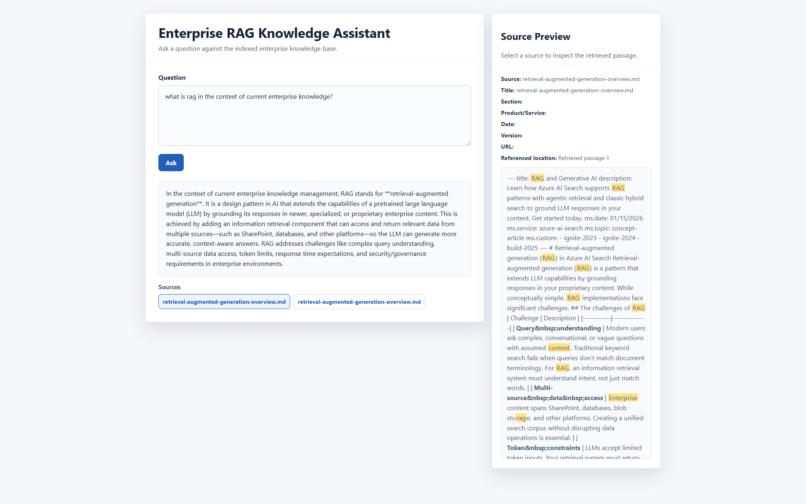
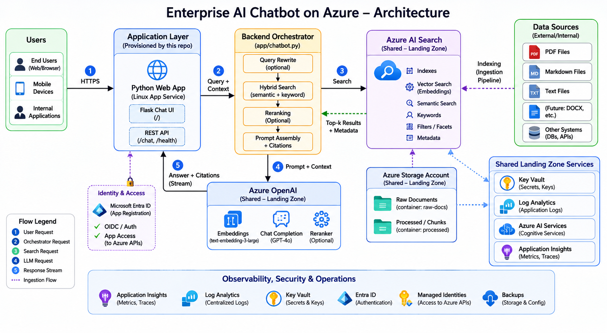

# Enterprise AI Chatbot

Terraform workload repo for deploying the `enterprise-ai-chatbot` Azure solution.

This project deploys a document-grounded Retrieval-Augmented Generation (RAG) chatbot on Azure. Users ask questions through a browser UI, the app retrieves relevant enterprise-controlled content from Azure AI Search, Azure OpenAI generates a grounded answer, and the UI returns the answer with citations and source previews.

The runtime is intentionally restricted: it does not search the public internet. It only searches content that has already been ingested, chunked, embedded, and indexed into Azure AI Search.

## Contents

- [Enterprise AI Chatbot](#enterprise-ai-chatbot)
  - [Contents](#contents)
  - [Experience](#experience)
  - [Architecture](#architecture)
    - [Logical Components](#logical-components)
  - [Repository Role](#repository-role)
    - [Provisioned By This Repo](#provisioned-by-this-repo)
    - [Reused From `landingzone`](#reused-from-landingzone)
  - [Runtime Flow](#runtime-flow)
    - [Runtime Tuning](#runtime-tuning)
    - [Grounded Answer Contract](#grounded-answer-contract)
    - [`/chat` Request Shape](#chat-request-shape)
  - [Document Ingestion](#document-ingestion)
    - [Required Environment Variables](#required-environment-variables)
    - [Metadata](#metadata)
  - [Terraform Layout](#terraform-layout)
    - [Important Inputs](#important-inputs)
    - [Tags](#tags)
  - [Environment Configuration](#environment-configuration)
  - [Local Validation](#local-validation)
  - [Pipelines](#pipelines)
    - [GitHub Actions](#github-actions)
    - [Azure DevOps](#azure-devops)
  - [Security and Governance](#security-and-governance)
    - [Identity and Access](#identity-and-access)
    - [Retrieval Authorization](#retrieval-authorization)
    - [Secrets and Keys](#secrets-and-keys)
    - [Network Security](#network-security)
    - [Prompt Injection](#prompt-injection)
  - [Observability and Reliability](#observability-and-reliability)
    - [Failure Handling](#failure-handling)
    - [Recommended Telemetry](#recommended-telemetry)
  - [Cost Controls](#cost-controls)
  - [Outputs](#outputs)
  - [Production Readiness](#production-readiness)
  - [Notes](#notes)
  - [Glossary](#glossary)

## Experience



The deployed Python app lives under [app/api](./app/api). Repo-root wrappers let Azure App Service boot the app from the deployed package:

| File | Purpose |
| --- | --- |
| [requirements.txt](./requirements.txt) | Forwards to `app/api/requirements.txt`. |
| [startup.sh](./startup.sh) | Changes into `app/api` and starts the app. |

The App Service startup command is configured in [terraform/main.tf](./terraform/main.tf):

```bash
bash /home/site/wwwroot/startup.sh
```

## Architecture



At a high level, the solution has four layers:

| Layer | Responsibility |
| --- | --- |
| User interaction | Browser chat experience where users ask questions and inspect cited sources. |
| Application orchestration | Azure App Service hosts the Python UI, `/chat` API, query orchestration, retrieval workflow, reranking, citation validation, and response rendering. |
| Retrieval and generation | Azure AI Search performs hybrid retrieval. Azure OpenAI creates embeddings, optionally reranks candidates, and generates grounded answers. |
| Platform and governance | Shared landing-zone resources provide Key Vault, Log Analytics, Storage, Azure OpenAI, Azure AI Service, and Azure AI Search. |

### Logical Components

| Component | Role |
| --- | --- |
| User / Browser | Renders the chat UI, submits questions, shows answers, citations, source previews, metadata, and highlighted matching terms. |
| Azure App Service | Central orchestrator. It owns authentication integration, request shaping, query rewrite, retrieval, filtering, reranking, prompt assembly, citation validation, and conservative refusals. |
| Microsoft Entra ID | Provides identity integration for the web app when App Service authentication is enabled. |
| Azure AI Search | Stores document chunks, vectors, metadata, and supports keyword, vector, hybrid, and optional semantic retrieval. |
| Azure OpenAI | Provides embeddings, query rewriting, reranking, and grounded answer generation. |
| Azure Blob Storage | Stores source documents and source previews. The search index is not the system of record. |
| Key Vault | Stores secrets and supports future managed-identity-based access patterns. |
| Log Analytics | Centralizes diagnostics, operational telemetry, and alert data. |
| Azure AI Service | Shared platform AI resource available for future capabilities such as document extraction, vision, or speech. |

## Repository Role

This repo is not a full landing zone. It is a workload repo that reuses shared platform resources from the sibling `landingzone` repo and provisions only the app-specific Azure pieces needed for this chatbot.

### Provisioned By This Repo

| Resource | Purpose |
| --- | --- |
| Application resource group | Logical container for chatbot workload resources when `resource_group_name` is supplied. |
| Linux App Service Plan | Compute plan for the Linux Python App Service. |
| Linux Python App Service | Hosts the chatbot web UI and `/chat` API. |
| Microsoft Entra app registration | Supports App Service authentication and identity integration. |
| RAG storage container | Stores ingested source documents in the shared landing-zone Storage Account. |
| Optional Azure AI Search query key | Supports key-based query access where needed. |
| Optional Azure OpenAI deployments | Creates chat and embedding deployments when the shared OpenAI account is looked up and enabled. |

### Reused From `landingzone`

These resources are looked up with Terraform data sources instead of being created here:

| Shared resource | Purpose |
| --- | --- |
| Shared resource group | Existing landing-zone resource group. |
| Storage account | Source documents, previews, app artifacts, or supporting files. |
| Key Vault | Secrets, keys, and sensitive configuration values. |
| Log Analytics workspace | Central logging and monitoring. |
| Azure OpenAI account | Chat and embedding model deployments. |
| Azure AI Service account | Reusable AI platform service for extension scenarios. |
| Azure AI Search service | Searchable document chunks and vectors. |

If a required shared resource does not exist, `terraform plan` should fail instead of silently creating duplicate platform resources. Azure AI Search can be disabled per environment with `landingzone_azure_ai_search_enabled`.

## Runtime Flow

Current `/chat` request flow:

1. The user posts a question to `/chat`.
2. If enabled, App Service authentication establishes Microsoft Entra identity context.
3. The app rewrites vague or follow-up questions into a standalone retrieval question.
4. The app generates expanded retrieval queries to improve recall.
5. The app embeds each retrieval query with the configured Azure OpenAI embedding deployment.
6. The app runs hybrid retrieval against Azure AI Search using keyword/full-text search and vector search.
7. Azure AI Search merges keyword and vector results with reciprocal rank fusion.
8. The app applies access and optional metadata filters.
9. The app deduplicates candidates returned by expanded queries.
10. The app optionally reranks the broader hybrid candidate set with the configured Azure OpenAI chat deployment.
11. The app assigns evidence IDs to reranked chunks and asks the chat deployment for a structured grounded answer.
12. The app verifies that returned citations reference real retrieved evidence IDs.
13. If citations are missing or evidence is weak, the app returns a conservative refusal instead of an unsupported answer.
14. The browser renders the answer, citations, clickable source previews, metadata, and highlighted matching terms.

### Runtime Tuning

| Setting | Default | Purpose |
| --- | --- | --- |
| `HYBRID_SEARCH_TOP` | `5` | Number of hybrid results used when reranking is disabled, and fallback count if reranking fails. |
| `HYBRID_VECTOR_K` | `8` | Number of vector neighbors requested before Azure AI Search fuses results. |
| `AZURE_SEARCH_SEMANTIC_CONFIGURATION` | empty | Optional Azure AI Search semantic configuration name. |
| `QUERY_REWRITE_ENABLED` | `true` | Enables standalone question rewriting and multi-query expansion. |
| `QUERY_EXPANSION_COUNT` | `3` | Maximum number of alternate retrieval queries generated before search. |
| `QUERY_REWRITE_HISTORY_MESSAGES` | `6` | Number of recent chat messages used to rewrite follow-up questions. |
| `RERANK_ENABLED` | `true` | Enables second-stage LLM reranking. |
| `RERANK_CANDIDATE_TOP` | `12` | Number of hybrid candidates retrieved before reranking. |
| `RERANK_TOP` | `5` | Number of reranked chunks sent to answer generation. |
| `RERANK_CONTENT_CHARS` | `1200` | Maximum characters per candidate sent to the reranker. |
| `MIN_GROUNDED_CITATIONS` | `1` | Minimum verified evidence citations required before returning an answer. |

Reranking improves precision but adds one extra chat completion call per question. Set `RERANK_ENABLED=false` for lower latency and lower demo cost.

### Grounded Answer Contract

Answer generation uses a structured JSON contract:

| Field | Meaning |
| --- | --- |
| `answer` | Final answer text. |
| `citations` | Evidence IDs used to support the answer. |
| `grounded` | Whether the model claims the answer is grounded in the provided evidence. |
| `refusal_reason` | Reason for refusal when the answer is not sufficiently supported. |

The app only accepts citations that match retrieved evidence IDs. A response without source evidence is not an acceptable RAG answer in this architecture.

### `/chat` Request Shape

The `/chat` endpoint accepts optional chat history, user groups, and metadata filters:

```json
{
  "question": "How do I configure vector search?",
  "user_groups": ["default"],
  "chat_history": [
    {
      "role": "user",
      "content": "Tell me about Azure AI Search."
    },
    {
      "role": "assistant",
      "content": "Azure AI Search supports keyword, vector, hybrid, and semantic search."
    }
  ],
  "filters": {
    "source_path": "retrieval-augmented-generation-overview.md",
    "document_title": "Retrieval augmented generation",
    "section_heading": "Indexing strategy",
    "product_service": "search",
    "document_date": "2025-09-01",
    "document_version": "2025-09-01",
    "url": "https://learn.microsoft.com/...",
    "access_group": "default"
  }
}
```

`chat_history` helps the app rewrite follow-up questions like "how do I configure that?" into standalone retrieval queries. All filter fields are optional. If omitted, the app only applies the existing access filter from `user_groups`.

## Document Ingestion

The ingestion script is [scripts/ingest_docs.py](./scripts/ingest_docs.py). It recursively reads `.md`, `.txt`, and `.pdf` files from `DOCS_PATH`, uploads source files to Blob Storage, chunks and embeds text, and writes searchable records into Azure AI Search.

The architecture diagram also shows DOCX as a source category. Treat DOCX as a future extension or preprocessing input unless the ingestion script is extended to parse `.docx` directly.

### Required Environment Variables

```powershell
$env:AZURE_OPENAI_ENDPOINT="https://<openai>.openai.azure.com/"
$env:AZURE_OPENAI_EMBED_DEPLOYMENT="embedding"
$env:AZURE_SEARCH_ENDPOINT="https://<search>.search.windows.net"
$env:AZURE_SEARCH_INDEX="enterprise-docs"
$env:STORAGE_ACCOUNT_NAME="<storage-account>"
$env:STORAGE_CONTAINER_NAME="documents"
$env:DOCS_PATH="path\to\docs"
```

For the current sandbox Search service, key auth is required for ingestion:

```powershell
$env:AZURE_SEARCH_ADMIN_KEY=(az search admin-key show --service-name srch-platform-cc-sbx --resource-group rg-platform-sbx --query primaryKey -o tsv)
$env:AZURE_STORAGE_ACCOUNT_KEY=(az storage account keys list --account-name stplatformccsbx --resource-group rg-platform-sbx --query '[0].value' -o tsv)
$env:AZURE_OPENAI_API_KEY=(az cognitiveservices account keys list --name oai-platform-cc-sbx --resource-group rg-platform-sbx --query key1 -o tsv)
python scripts\ingest_docs.py
```

### Metadata

Each chunk includes metadata for filtering and source inspection:

| Field | Source |
| --- | --- |
| `source_path` | Relative file path under `DOCS_PATH`. |
| `document_title` | `title` metadata, first H1, or file name. |
| `section_heading` | Nearest heading inside the chunk. |
| `product_service` | `INGEST_PRODUCT_SERVICE`, `ms.service`, `service`, or folder name. |
| `document_date` | `ms.date` or `date` metadata. |
| `document_version` | `ms.version` or `version` metadata. |
| `url` | `url`, `canonical_url`, `ms.authoring-url`, or `DOCS_BASE_URL` plus path. |
| `access_group` | `INGEST_ACCESS_GROUP`, default `default`. |

Markdown line structure is preserved so source previews can render headings, lists, links, blockquotes, and code blocks. If content was ingested before markdown-preserving chunks or metadata fields were added, recreate or migrate the index before using metadata filters.

## Terraform Layout

| File or folder | Purpose |
| --- | --- |
| [terraform/main.tf](./terraform/main.tf) | Root resource composition. |
| [terraform/data.tf](./terraform/data.tf) | Shared `landingzone` lookups. |
| [terraform/variables.tf](./terraform/variables.tf) | Root inputs. |
| [terraform/outputs.tf](./terraform/outputs.tf) | Root outputs. |
| [terraform/providers.tf](./terraform/providers.tf) | Provider configuration. |
| [terraform/versions.tf](./terraform/versions.tf) | Terraform and provider version constraints. |
| [terraform/environments/dev](./terraform/environments/dev) | Dev backend and tfvars. |
| [terraform/environments/sandbox](./terraform/environments/sandbox) | Sandbox backend and tfvars. |
| [terraform/environments/prod](./terraform/environments/prod) | Production backend and tfvars. |

### Important Inputs

Common workload inputs:

| Input | Purpose |
| --- | --- |
| `features` | Optional high-level feature map using the landingzone pattern. Unspecified keys fall back to the individual variables. |
| `workload` | Workload name used for names, tags, and module inputs. |
| `environment` | Target environment. |
| `resource_group_name` | Optional application resource group override. |
| `app_service_plan_name` | Optional App Service Plan name override. |
| `app_service_name` | Optional globally unique App Service name override. |
| `app_registration_display_name` | Optional Entra app registration display name override. |
| `app_service_python_version` | Python runtime version. |
| `app_service_enable_auth` | Enables App Service authentication wiring. |
| `azure_openai_chat_deployment` | Chat deployment name exposed to the app. |
| `azure_openai_embed_deployment` | Embedding deployment name exposed to the app. |
| `azure_search_index` | Search index name exposed to the app. |

Shared-resource lookup inputs:

| Input | Purpose |
| --- | --- |
| `landingzone_resource_group_name` | Existing landing-zone resource group. |
| `landingzone_storage_account_name` | Existing landing-zone Storage Account. |
| `landingzone_key_vault_name` | Existing landing-zone Key Vault. |
| `landingzone_log_analytics_name` | Existing landing-zone Log Analytics workspace. |
| `landingzone_openai_name` | Existing Azure OpenAI account. |
| `landingzone_azure_ai_service_name` | Existing Azure AI Service account. |
| `landingzone_azure_ai_search_name` | Existing Azure AI Search service. |
| `landingzone_azure_ai_search_enabled` | Backwards-compatible fallback for the `features.enable_azure_ai_search` flag. |

Supported feature keys:

| Feature key | Purpose |
| --- | --- |
| `enable_app_service_stack` | Creates the App Service Plan, App Service, and workload role assignments. |
| `enable_app_registration_for_appservice` | Creates the Entra app registration when the app stack is enabled. |
| `enable_openai` | Looks up and wires the shared Azure OpenAI account. |
| `enable_azure_ai_service` | Looks up and wires the shared Azure AI Service account. |
| `enable_azure_ai_search` | Looks up and wires the shared Azure AI Search service. |
| `create_azure_search_query_key` | Creates and injects a workload-specific Azure AI Search query key when no query key is supplied. |

### Tags

This repo follows the `landingzone` tag pattern for App Service Plan and App Service resources:

- Governance tags come from `rg_tags`.
- `Workload` is added from `var.workload`.
- Extra optional tags can be supplied through `tags`.
- Case-conflicting keys like lowercase `workload` and `environment` are filtered out to avoid colliding with canonical landing-zone tags.

## Environment Configuration

The repo includes `dev`, `sandbox`, and `prod` folders. Each environment has its own backend configuration and tfvars.

| Environment | Purpose | Notes |
| --- | --- | --- |
| Dev | Engineering validation | Uses shared landing-zone dev resources from the sibling `landingzone` repo. |
| Sandbox | Integration and demo | Uses sandbox shared resources and enables Azure AI Search lookup. |
| Prod | Production placeholder | Contains placeholder values and must be completed before real deployment. |

The dev workload tfvars should stay aligned with `../landingzone/environments/dev/terraform.tfvars`. The landing-zone naming convention derives names from workload, region code, and environment. For example, `location = "canadacentral"`, `workload = "platform"`, and `environment = "dev"` produce shared names such as `stplatformccdev`, `kvplatformccdev`, and `law-platform-cc-dev`.

## Local Validation

Typical local workflow:

```powershell
$env:TF_DATA_DIR = "C:\terraform-cache\repos\CCOE-Azure\IaC\enterprise-ai-chatbot"
cd terraform
terraform fmt -recursive
terraform init -backend-config="environments/dev/backend.hcl" -reconfigure
terraform validate
terraform plan -var-file="environments/dev/terraform.tfvars"
```

For isolated syntax validation without remote backend auth:

```powershell
$env:TF_DATA_DIR = "C:\terraform-cache\repos\CCOE-Azure\IaC\enterprise-ai-chatbot"
cd terraform
terraform init -backend=false
terraform validate
```

## Pipelines

### GitHub Actions

GitHub Actions is defined in [.github/workflows/terraform.yml](./.github/workflows/terraform.yml).

Current behavior:

- Validates and plans selected environments from `DEPLOY_DEV` and `DEPLOY_SANDBOX`.
- Supports manual `workflow_dispatch` apply for the selected environment matrix.
- Can publish to a stage repo.
- Can mirror to an Azure DevOps repo.

Important GitHub secrets:

| Secret | Purpose |
| --- | --- |
| `AZURE_CLIENT_ID` | Azure service principal client ID. |
| `AZURE_CLIENT_SECRET` | Azure service principal secret. |
| `AZURE_TENANT_ID` | Azure tenant ID. |
| `AZURE_SUBSCRIPTION_ID` | Azure subscription ID. |
| `AZURE_ADO_PAT2` | Azure DevOps PAT. |
| `INFRACOST_API_KEY` | Infracost integration. |
| `STAGE_REPO_URL` | Stage repository URL. |
| `STAGE_REPO_TOKEN` | Stage repository token. |
| `ADO_REPO_URL` | Azure DevOps repository URL. |
| `ADO_REPO_PAT` | Azure DevOps repository PAT. |

For production, prefer workload identity federation or OIDC over long-lived client secrets where possible.

### Azure DevOps

Azure DevOps is defined in [azure-pipelines.yml](./azure-pipelines.yml).

Current behavior:

- Validates the repo on `main`, `dev`, `sandbox`, and `sbx`.
- Runs current sandbox plan/apply for `main`, `sandbox`, and `sbx`.
- Runs dev plan/apply for `main` and `dev`.

The pipeline expects the shared template repo and the Azure service connections configured in the YAML. The `templateRepo` resource uses `name: template` so Azure DevOps resolves the `template` repository from the current project. This lets the same YAML run in projects such as `IaC` and `CCoE-Infra-IaC` without hard-coding the project name.

Checkout-heavy jobs call [templates/shared-runner-hygiene.yml](./templates/shared-runner-hygiene.yml) before and after work. This matches the sibling `landingzone` and `template` pipeline pattern and clears stale Git `extraheader` credentials on shared/self-hosted runners.

The Azure DevOps package build uses `ADO_PACKAGE_PYTHON_VERSION` for the agent-side `UsePythonVersion@0` task. This is intentionally separate from Terraform's `app_service_python_version`, which controls the App Service runtime.

## Security and Governance

### Identity and Access

Authentication and authorization are separate controls:

- Authentication confirms who the user is.
- Authorization determines which documents or chunks the user can retrieve.
- Grounding determines whether the answer is supported by retrieved evidence.

Minimum expectations:

- Enforce App Service authentication for restricted deployments.
- Configure app assignment when access is limited to specific users or groups.
- Derive or validate user group context server-side.
- Apply access filters in the backend before answer generation.
- Never rely on the browser as the enforcement point.

### Retrieval Authorization

Retrieval authorization is the most important security control in a RAG system. If Azure AI Search returns unauthorized chunks, the model can expose restricted content while still appearing grounded.

The architecture supports an `access_group` metadata field. Each chunk should carry an access group or equivalent ACL metadata, and search queries should filter results to authorized groups.

### Secrets and Keys

Key Vault should store secrets. Current sandbox ingestion uses key-based authentication for Azure AI Search, Storage, and Azure OpenAI. That is acceptable for sandbox testing, but production should move toward managed identity and RBAC where service support allows it.

Production recommendations:

- Use managed identity where possible.
- Store remaining keys in Key Vault.
- Rotate keys.
- Avoid environment dumps in logs.
- Avoid long-lived credentials in repository or pipeline files.

### Network Security

The diagram is logical and does not prove that private endpoints, VNet integration, firewall routing, or private DNS are implemented.

For production, explicitly define:

- App Service VNet integration.
- Private endpoint requirements for Azure OpenAI, Azure AI Search, Storage, and Key Vault.
- Public network access policy for each service.
- Private DNS zone ownership and resolution.
- Outbound route control from App Service.
- Diagnostic logging for denied requests.

### Prompt Injection

Retrieved content is untrusted input. A malicious document can try to override instructions or leak data.

Required mitigations:

- Keep system and developer instructions separate from retrieved evidence.
- Do not let retrieved content override instructions.
- Limit tool or function access from the model.
- Validate citations.
- Refuse unsupported answers.
- Log suspicious prompt-injection patterns according to privacy policy.

## Observability and Reliability

### Failure Handling

| Failure | Expected behavior |
| --- | --- |
| Azure AI Search unavailable | Return a controlled error. Do not answer from model memory. |
| Azure OpenAI embedding call fails | Return a controlled retrieval failure. |
| Azure OpenAI answer generation fails | Return a controlled generation failure. |
| Reranking fails | Fall back to non-reranked hybrid results if configured. |
| No relevant evidence found | Return a conservative refusal. |
| Citations missing or invalid | Refuse or return a guarded response. |
| Index schema mismatch | Fail ingestion and report the schema issue. |
| Missing shared resource | Terraform plan fails. |
| Authentication misconfiguration | Fail closed for restricted deployments. |

The correct bias is fail-closed for security and grounding failures.

### Recommended Telemetry

- Request count and latency.
- Authentication failures.
- Search latency and errors.
- OpenAI embedding and chat latency.
- Reranking latency.
- Retrieved and reranked chunk counts.
- Verified citation count.
- Refusal and no-evidence rates.
- Invalid-citation rate.
- Token usage and cost indicators.
- Ingestion success/failure counts.
- Indexing duration, document counts, and chunk counts.

Logs must avoid storing sensitive prompts or retrieved content unless there is a documented privacy and retention policy.

## Cost Controls

Main cost drivers:

| Component | Cost driver |
| --- | --- |
| App Service Plan | SKU and instance count. |
| Azure OpenAI chat deployment | Token usage for query rewriting, reranking, and answer generation. |
| Azure OpenAI embedding deployment | Number and size of queries and document chunks embedded. |
| Azure AI Search | SKU, replicas, partitions, vector index size, and query volume. |
| Storage Account | Stored source documents, previews, and transactions. |
| Log Analytics | Ingested log volume and retention. |

Cost-control levers:

- Disable reranking for low-cost demos.
- Reduce `QUERY_EXPANSION_COUNT`.
- Reduce `RERANK_CANDIDATE_TOP`.
- Reduce `RERANK_CONTENT_CHARS`.
- Tune chunk size to avoid excessive chunk counts.
- Avoid verbose logging of full prompts and retrieved evidence.
- Use environment-appropriate Azure AI Search SKUs.

## Outputs

Useful outputs from this root include:

- App Service name and URL.
- App Service Plan ID.
- App Service managed identity principal ID.
- App registration application ID.
- Resolved Azure OpenAI endpoint.
- Resolved Azure AI Service endpoint.
- Resolved Azure AI Search endpoint.
- Resolved shared landing-zone resource IDs.

## Production Readiness

Before production deployment, verify:

- App Service authentication is enabled and tested.
- App assignment and allowed user/group access are configured.
- Retrieval authorization is enforced server-side.
- Azure AI Search index schema is reviewed and versioned.
- Source documents are classified and assigned access groups.
- Key Vault stores required secrets.
- Managed identity is used where possible.
- Public network access policy is explicit for each service.
- Private endpoint and DNS design is documented if private networking is required.
- Logs and metrics flow to Log Analytics.
- Alerts are configured.
- Reranking cost impact is understood.
- Token usage and cost monitoring are implemented.
- Ingestion is repeatable.
- Index rebuild process is tested.
- Citation validation is enabled.
- Unsupported answers result in refusal, not hallucination.
- Production tfvars contain real resource names and no placeholders.
- CI/CD approval gates exist for production.
- Rollback exists for both infrastructure and app code.

Recommended improvements:

- Add DOCX parsing or remove DOCX from diagrams as a current capability.
- Replace sandbox key-based ingestion with managed identity where possible.
- Define private networking explicitly for production.
- Add index lifecycle management for schema migrations and rebuilds.
- Add document freshness controls using date and version metadata.
- Add a RAG evaluation harness with golden questions, expected citations, and retrieval metrics.
- Define content governance for upload, approval, access groups, retirement, and citation audits.

## Notes

- This repo depends on shared Terraform modules from the Azure DevOps `template` repo.
- Azure DevOps resolves the `template` repo from the current project through `name: template`; keep the local checkout path as `s/template` so Terraform module sources such as `../../template//modules/...` continue to resolve.
- This repo depends on shared platform resources that already exist in the sibling `landingzone` repo.
- `sandbox` uses `app_env = sbx` when calling shared App Service modules because that is the accepted environment code in the upstream module.
- Detailed current deployment notes are also documented in [docs/current-deployment-architecture.md](./docs/current-deployment-architecture.md).

## Glossary

| Term | Meaning |
| --- | --- |
| RAG | Retrieval-Augmented Generation. A pattern where external knowledge is retrieved and supplied to a language model before answer generation. |
| Chunk | A smaller unit of document text stored and searched in the retrieval index. |
| Embedding | A vector representation of text used for semantic similarity search. |
| Hybrid search | Retrieval that combines keyword/full-text search and vector search. |
| Reranking | A second-stage process that reorders retrieved candidates by relevance. |
| Grounded answer | An answer supported by retrieved evidence. |
| Citation validation | Application-side check that model citations reference actual retrieved evidence IDs. |
| Landing zone | Shared enterprise platform foundation providing common governance, monitoring, identity, networking, and shared services. |
