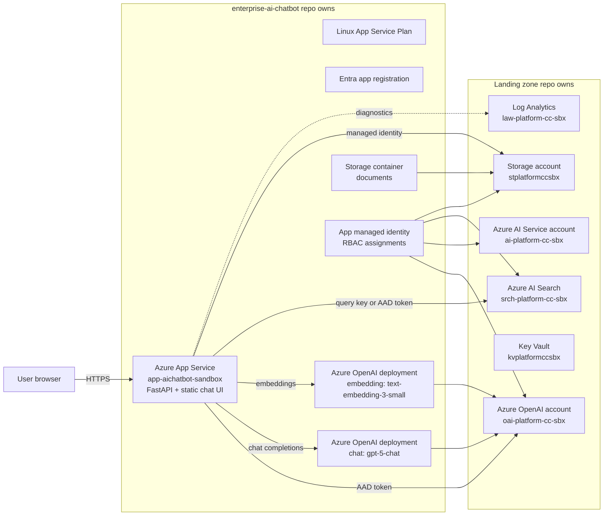

# Enterprise AI Chatbot Current Deployment Architecture

## Purpose

This workload deploys a Python RAG chatbot on Azure App Service. The app answers user questions by embedding the question with Azure OpenAI, retrieving relevant chunks from Azure AI Search, and sending the retrieved context to a chat model deployment in Azure OpenAI.

The repo is intentionally a workload repo, not a landing zone repo. It reuses shared platform resources that already exist in the landing zone and creates only the app-specific resources needed by this chatbot.

## Current Sandbox Shape

The current sandbox configuration in `environments/sandbox/terraform.tfvars` resolves to:

| Area | Current value |
| --- | --- |
| Azure region | `canadacentral` |
| Workload | `aichatbot` |
| Environment | `sandbox` |
| App Service | `app-aichatbot-sandbox` |
| App Service Plan | `asp-aichatbot-sandbox` |
| Landing zone resource group | `rg-platform-sbx` |
| Azure OpenAI account | `oai-platform-cc-sbx` |
| Azure AI Service account | `ai-platform-cc-sbx` |
| Azure AI Search service | `srch-platform-cc-sbx` |
| Storage account | `stplatformccsbx` |
| Key Vault | `kvplatformccsbx` |
| Log Analytics workspace | `law-platform-cc-sbx` |
| RAG storage container | `documents` |
| Search index | `enterprise-docs` |
| Chat deployment | `chat` |
| Embedding deployment | `embedding` |

## Architecture View

## Ownership Boundaries

### Landing Zone Owned

The landing zone owns shared, environment-level platform resources:

- Resource group
- Storage account
- Key Vault
- Log Analytics workspace
- Azure OpenAI account
- Azure AI Service account
- Azure AI Search service
- Networking resources such as VNet, subnets, private DNS zones, and optional private endpoint subnets

This workload reads those resources through Terraform data sources in `data.tf`.

### Workload Repo Owned

This repo owns app-specific resources:

- Linux App Service Plan
- Linux Python App Service
- Entra app registration
- App Service system-assigned managed identity
- Azure OpenAI chat deployment inside the landing zone OpenAI account
- Azure OpenAI embedding deployment inside the landing zone OpenAI account
- `documents` container inside the landing zone storage account
- RBAC assignments for the App Service identity
- App Service settings needed by the Python API

This split keeps expensive/shared platform resources centralized while letting the app team independently manage model deployments, app settings, code, and identity permissions.

## Runtime Flow

1. The user opens the App Service URL in a browser.
2. The FastAPI app serves a simple HTML chat page from `app/api/main.py`.
3. The browser posts a question to `/chat`.
4. The API validates that the question is not empty.
5. The API uses Azure OpenAI deployment `embedding` to create a vector for the question.
6. The API queries Azure AI Search index `enterprise-docs` with hybrid keyword + vector search.
7. The API filters results by `security_group` using the `user_groups` request value. Today the UI sends `["default"]`.
8. The API builds context from returned chunks.
9. The API sends the user question and retrieved context to Azure OpenAI deployment `chat`.
10. The API returns the answer and retrieved source passages to the browser.
11. The browser renders clickable source buttons. When a source is selected, the right-side Source Preview panel shows the retrieved passage and highlights matching question terms.

## Ingestion Flow

The ingestion script is `scripts/ingest_docs.py`.

1. The script reads documents from `DOCS_PATH`, defaulting to `./sample_docs`.
2. It supports `.txt`, `.md`, and `.pdf`.
3. It uploads source documents into the `documents` blob container.
4. It chunks document text.
5. It embeds each chunk with the `embedding` deployment.
6. It creates the Azure AI Search index if missing.
7. It uploads chunk records with fields:
   - `id`
   - `content`
   - `title`
   - `source_path`
   - `security_group`
   - `content_vector`

The current sample ACL model is intentionally minimal: every ingested chunk uses `security_group = "default"`. This should be replaced with real ACL metadata before production use.

The ingestion script scans `DOCS_PATH` recursively and currently supports `.txt`, `.md`, and `.pdf`. Markdown line structure is preserved in indexed chunks so the source preview can render headings, lists, links, blockquotes, and code blocks. Document IDs are deterministic and prefixed with a safe letter because Azure AI Search document keys cannot start with an underscore. Upload batch size defaults to `25` chunks and can be changed with `INGEST_UPLOAD_BATCH_SIZE`.

## Retrieval Design

The chatbot uses hybrid retrieval by default. Each `/chat` request sends both:

- `search_text=req.question` for keyword/full-text retrieval over searchable text fields.
- `vector_queries=[VectorizedQuery(...)]` for semantic vector retrieval over `content_vector`.

Azure AI Search merges the keyword and vector result sets with reciprocal rank fusion. This is intentional: vector search is strong for semantic similarity, while keyword search is better for exact terms such as product names, error codes, CLI commands, SKU names, and acronyms.

The runtime settings are:

| Setting | Default | Purpose |
| --- | --- | --- |
| `HYBRID_SEARCH_TOP` | `5` | Number of merged hybrid results returned to the app |
| `HYBRID_VECTOR_K` | `8` | Number of nearest vector neighbors requested before fusion |
| `AZURE_SEARCH_SEMANTIC_CONFIGURATION` | empty | Optional semantic ranker configuration name. When set, the app asks Azure AI Search to apply semantic ranking after hybrid retrieval |

If semantic ranking is enabled on the Search service and a semantic configuration exists on the index, set `AZURE_SEARCH_SEMANTIC_CONFIGURATION` to that configuration name. Leave it empty for the current lightweight demo path.

## App Settings

Terraform sets these application settings for the App Service:

| Setting | Source |
| --- | --- |
| `AZURE_OPENAI_ENDPOINT` | Landing zone OpenAI account endpoint |
| `AZURE_AI_SERVICE_ENDPOINT` | Landing zone AI Service endpoint |
| `AZURE_OPENAI_CHAT_DEPLOYMENT` | Workload-created chat deployment name |
| `AZURE_OPENAI_EMBED_DEPLOYMENT` | Workload-created embedding deployment name |
| `AZURE_SEARCH_ENDPOINT` | Landing zone Azure AI Search endpoint |
| `AZURE_SEARCH_INDEX` | `enterprise-docs` by default |
| `HYBRID_SEARCH_TOP` | Optional. Defaults to `5` when not set |
| `HYBRID_VECTOR_K` | Optional. Defaults to `8` when not set |
| `AZURE_SEARCH_SEMANTIC_CONFIGURATION` | Optional semantic ranker configuration name |
| `STORAGE_ACCOUNT_NAME` | Landing zone storage account name |
| `STORAGE_CONTAINER_NAME` | Workload-created container name |
| `AZURE_SEARCH_QUERY_KEY` | Search query key. Terraform can create a workload query key through AzAPI when `azure_search_query_key` is not supplied |
| `SCM_DO_BUILD_DURING_DEPLOYMENT` | Enables Oryx build during deployment |
| `ENABLE_ORYX_BUILD` | Enables Oryx build behavior |

## Identity and Access

The App Service uses a system-assigned managed identity. Terraform grants it:

- `Cognitive Services OpenAI User` on the Azure OpenAI account
- `Cognitive Services User` on the Azure AI Service account
- `Search Index Data Reader` on Azure AI Search
- `Storage Blob Data Reader` on the storage account

Current Search caveat: the sandbox Search service is configured as `apiKeyOnly`, so the app supports `AZURE_SEARCH_QUERY_KEY` as a compatibility path. If the Search service is later configured to allow Entra ID/RBAC auth, the query key can be removed and the app can use managed identity end to end.

For ingestion, creating or updating the Search index requires admin-level Search access. When the Search service is `apiKeyOnly`, run ingestion with `AZURE_SEARCH_ADMIN_KEY`. Local ingestion can also use `AZURE_STORAGE_ACCOUNT_KEY` and `AZURE_OPENAI_API_KEY` if the local Entra identity cannot access the landing zone tenant or resources.

## Network Access

Current sandbox is intentionally public enough for hosted Azure Pipelines and demo use:

- App Service public network access is enabled.
- Main site access restrictions default to `Allow`.
- SCM/Kudu access remains separate and can be locked down.
- App Service private endpoint is disabled.
- Optional private endpoint and private DNS patterns are preserved as commented code in `main.tf`.

For production, prefer private endpoint access for App Service, Storage, Search, OpenAI, AI Service, and Key Vault, with public network access disabled where operationally feasible.

## Deployment Flow

Azure DevOps pipeline behavior:

1. Validate Terraform formatting and syntax.
2. Build Python app package.
3. Plan sandbox or dev depending on branch.
4. Apply Terraform for the selected environment.
5. Deploy the Python app package to App Service.

The Terraform plan/apply scripts use `-lock-timeout=10m` to reduce transient failures when another pipeline run temporarily holds the remote state blob lock.

## Operational Notes

- The App Service health endpoint is `/healthz`.
- `/healthz` reports missing required app settings.
- Runtime dependency compatibility is controlled through `app/api/requirements.txt`.
- The app currently pins `openai==1.51.2` and `httpx<0.28.0` to avoid the `Client.__init__() got an unexpected keyword argument 'proxies'` runtime issue.
- Search query auth is selected at runtime:
  - `AZURE_SEARCH_QUERY_KEY` present: use key auth.
  - `AZURE_SEARCH_QUERY_KEY` absent: use managed identity.
- Source preview is selected in the browser. The API returns the retrieved chunk text, and the UI highlights matching question terms client-side.
- Retrieval is hybrid by default. The app combines keyword/full-text search with vector search, and can optionally request semantic ranking when `AZURE_SEARCH_SEMANTIC_CONFIGURATION` is configured.

## Current Strengths

- Clear separation between landing zone owned resources and workload owned resources.
- App-specific OpenAI deployments are managed by this repo while the OpenAI account remains shared.
- Managed identity is used for OpenAI and storage access.
- Search can operate with either query key or managed identity depending on landing zone configuration.
- Clickable source previews make it easier to inspect which retrieved passage grounded an answer.
- Hybrid retrieval improves recall for both semantic questions and exact strings such as CLI commands, model names, SKU names, acronyms, and error codes.
- Model and index names are configurable but have working demo defaults.
- Terraform uses existing shared modules for App Service and App Service Plan consistency.

## Risks and Gaps

- Search is currently `apiKeyOnly` in sandbox, which weakens the managed identity story.
- Query keys are sensitive and must not be committed to tfvars or logs.
- The UI sends `user_groups = ["default"]`, so document-level authorization is only a placeholder.
- Source preview shows the retrieved passage, not original file line numbers. The current index does not store `start_line` or `end_line`.
- Source preview markdown rendering depends on markdown-preserving chunks. Content ingested before the markdown-preserving chunker was added should be reingested to render cleanly.
- Ingestion is manual/script-driven and not yet a first-class pipeline stage.
- The Python app has inline HTML/CSS/JavaScript rather than a separate frontend build.
- Module sources point to `ref=main`; production should pin them to a tag or commit SHA.
- Private endpoints are disabled for sandbox and only scaffolded as commented code.
- There is no automated smoke test after deployment.
- There is no automated validation that the configured OpenAI deployment model/SKU is deployable in the target region before apply.

## Recommended Improvements

### Short Term

- Store `azure_search_query_key` securely in Azure DevOps variable groups or Key Vault-backed variables if Search remains key-only.
- Add a pipeline smoke test after deploy:
  - GET `/healthz`
  - POST `/chat` with a tiny known question
- Add a dedicated ingestion pipeline stage for sample/demo docs.
- Add a small README section describing how to run `scripts/ingest_docs.py`.
- Add App Service log streaming or Application Insights setup to make runtime failures easier to diagnose.

### Security Hardening

- Change Azure AI Search from `apiKeyOnly` to allow Entra ID/RBAC auth, then remove `AZURE_SEARCH_QUERY_KEY`.
- Enable App Service authentication for user-facing access.
- Replace the placeholder `default` security group with real Entra group or document ACL metadata.
- Restrict App Service public access with IP restrictions, Front Door, Application Gateway, or private endpoint.
- Enable private endpoints for OpenAI, Search, Storage, Key Vault, and the App Service.
- Store secrets and optional keys in Key Vault rather than pipeline variables or plain app settings where possible.

### RAG Quality

- Improve chunking from fixed character windows to token-aware chunking.
- Add metadata fields such as department, source system, owner, last modified time, document type, and sensitivity label.
- Enable semantic ranking and add a semantic configuration if the Search SKU supports it.
- Add reranking for top retrieved chunks.
- Add original document line offsets or page numbers to citation metadata.
- Add answer-level citation formatting that maps answer claims to specific retrieved chunks.
- Add feedback capture for thumbs up/down and unanswered questions.

### Reliability and Operations

- Add retry/backoff around OpenAI and Search calls.
- Add request correlation IDs and structured logs.
- Add App Insights traces for:
  - question received
  - embedding latency
  - search latency
  - chat completion latency
  - token counts
  - failure type
- Add health checks that optionally verify Search/OpenAI connectivity beyond configuration presence.
- Add dashboards for App Service errors, Search query failures, OpenAI throttling, and latency.

### Cost Management

- Keep `gpt-5-chat` for demos only if needed for deployability and quality.
- Evaluate lower-cost deployable chat options per region and subscription quota when available.
- Keep `text-embedding-3-small` as the default embedding model for cost-efficient demos.
- Tune `top=5` retrieval and `max_tokens=900` to control chat token usage.
- Add budget alerts on the shared OpenAI account and Search service.

### Product Extensions

- Add multi-user authentication and group-aware filtering.
- Add document upload UI with background ingestion.
- Add admin page for index status, document counts, and last ingestion run.
- Add conversation history with a storage-backed session store.
- Add multi-index or multi-tenant routing.
- Add source connectors for SharePoint, Blob Storage folders, Git repos, or ServiceNow knowledge bases.
- Add prompt/version management so prompt changes can be reviewed and rolled back.

## Production Readiness Checklist

- [ ] Pin shared Terraform module refs to immutable tags or SHAs.
- [ ] Remove Search query key dependency by enabling Search RBAC auth, or store the key in Key Vault.
- [ ] Enable App Service auth and decide who can access the app.
- [ ] Implement real document ACL ingestion.
- [ ] Enable private endpoints and private DNS for production.
- [ ] Add ingestion pipeline and smoke tests.
- [ ] Add observability with Application Insights.
- [ ] Configure budgets and alerts.
- [ ] Complete prod tfvars placeholders before enabling production deployment.
